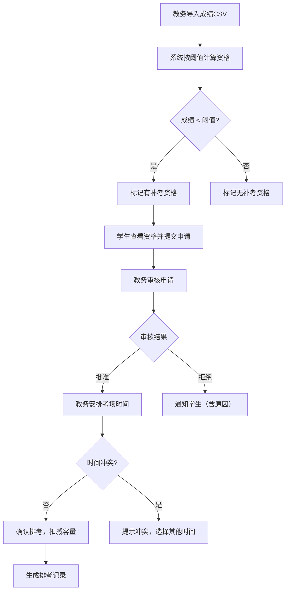

## 1. 产品概述

课程补考资格与安排管理系统，面向高校补考全流程：从成绩导入、资格自动判定、学生申请、教务审核到考场排考，确保每个环节可追溯、可审计。目标用户为在校学生、任课教师和教务管理人员。

## 2. 核心功能

### 2.1 用户角色

| 角色 | 登录方式 | 核心权限 |
|------|---------|---------|
| 学生 | 学号 + 密码 | 查看个人成绩与补考资格、提交/撤回补考申请、查看个人排考安排 |
| 任课教师 | 工号 + 密码 | 查看所授课程成绩与资格列表、查看排考安排 |
| 教务 | 工号 + 密码 | 导入成绩、配置阈值、审核申请、安排考场时间、人工覆盖/取消资格、导出名单与排考表 |

### 2.2 功能模块

1. **登录页**：角色选择与身份认证
2. **仪表盘**：角色对应的数据概览与快捷入口
3. **成绩管理页**：CSV 导入、成绩列表、资格计算
4. **资格管理页**：资格列表、来源追溯、人工覆盖/取消
5. **申请管理页**：学生提交申请、教务审核列表
6. **排考管理页**：考场定义、时间安排、容量实时扣减
7. **导出页**：通知名单导出、排考表导出
8. **阈值配置页**：补考分数阈值设置与历史记录

### 2.3 页面详情

| 页面名称 | 模块名称 | 功能描述 |
|---------|---------|---------|
| 登录页 | 角色登录 | 选择角色（学生/教师/教务），输入账号密码，登录后跳转对应仪表盘 |
| 学生仪表盘 | 资格概览 | 显示有资格的课程列表、待提交申请、已提交申请状态、已排考安排 |
| 教师仪表盘 | 课程概览 | 显示所授课程的成绩分布、有资格学生数、排考进度 |
| 教务仪表盘 | 全局概览 | 待审核申请数、排考进度、考场余量预警、最近操作记录 |
| 成绩管理页 | CSV 导入 | 上传 CSV 文件解析并导入成绩，显示导入结果与错误提示 |
| 成绩管理页 | 成绩列表 | 按课程/学生筛选成绩，显示是否达标及资格状态 |
| 资格管理页 | 资格列表 | 展示所有补考资格，含来源（自动计算/人工覆盖）、状态、原因 |
| 资格管理页 | 人工覆盖 | 教务可覆盖资格状态，必须填写原因，原记录标记为"已覆盖" |
| 资格管理页 | 取消资格 | 教务可取消已批准资格，必须填写原因，释放已占座位 |
| 申请管理页 | 学生申请 | 学生选择有资格的课程提交补考申请，可查看申请状态 |
| 申请管理页 | 审核列表 | 教务查看待审核申请，批准或拒绝，拒绝需填写原因 |
| 排考管理页 | 考场管理 | 添加/编辑考场（名称、容量、位置），显示实时余量 |
| 排考管理页 | 排考安排 | 为已批准申请分配考场和时间，检测时间冲突，实时扣减容量 |
| 导出页 | 名单导出 | 导出补考通知名单（CSV），含学生、课程、时间、地点 |
| 导出页 | 排考表导出 | 导出排考总表（CSV），含全部排考信息 |
| 阈值配置页 | 阈值设置 | 设置补考资格分数线，修改后重新计算资格，保留配置历史 |

## 3. 核心流程

### 3.1 补考资格判定流程

教务导入课程成绩 → 系统按配置阈值自动计算补考资格 → 生成资格记录（来源：自动计算）→ 学生查看资格列表

### 3.2 申请与排考流程

学生提交补考申请 → 教务审核申请（批准/拒绝）→ 教务为已批准申请安排考场和时间 → 系统检测时间冲突 → 实时扣减考场容量 → 生成排考记录

### 3.3 异常处理流程

取消已批准申请 → 释放座位容量 → 标记取消原因 → 人工覆盖资格 → 保留覆盖原因与原始记录

### 流程图

## 4. 用户界面设计

### 4.1 设计风格

- 主色调：深靛蓝 (#1e293b) + 琥珀强调色 (#f59e0b)，传达严谨与高效
- 次要色：石板灰 (#64748b) 用于辅助信息
- 按钮风格：圆角（8px），主操作实心填充，次操作描边
- 字体：思源黑体 / Noto Sans SC，标题 20-24px，正文 14px，辅助 12px
- 布局：左侧导航 + 右侧内容区，顶部面包屑
- 图标：lucide-react 图标库
- 表格为主的数据展示，卡片式概览

### 4.2 页面设计概览

| 页面名称 | 模块名称 | UI 元素 |
|---------|---------|---------|
| 登录页 | 角色登录 | 居中卡片，角色选择标签页，表单输入，主色按钮 |
| 学生仪表盘 | 资格概览 | 统计卡片（有资格数/待申请/已排考），资格课程列表，申请状态时间线 |
| 教务仪表盘 | 全局概览 | 统计卡片（待审核/已排考/考场余量预警），待审核申请快捷列表，最近操作日志 |
| 成绩管理页 | CSV导入 | 拖拽上传区域，导入结果表格（成功/失败行），成绩数据表格含筛选器 |
| 资格管理页 | 资格列表 | 数据表格（来源标签、状态徽章），操作按钮（覆盖/取消），弹窗填写原因 |
| 申请管理页 | 审核列表 | 申请卡片列表（学生信息、课程、状态），批量审核操作，审核弹窗 |
| 排考管理页 | 排考安排 | 考场卡片（容量进度条），日历视图选时间，排考确认弹窗含冲突检测提示 |
| 导出页 | 名单导出 | 预览表格，导出按钮（CSV格式），筛选条件选择器 |
| 阈值配置页 | 阈值设置 | 滑块/输入框设置分数，配置历史时间线，保存确认弹窗 |

### 4.3 响应式设计

- 桌面优先设计，最小宽度 1024px
- 表格在窄屏下支持横向滚动
- 卡片布局自适应列数
