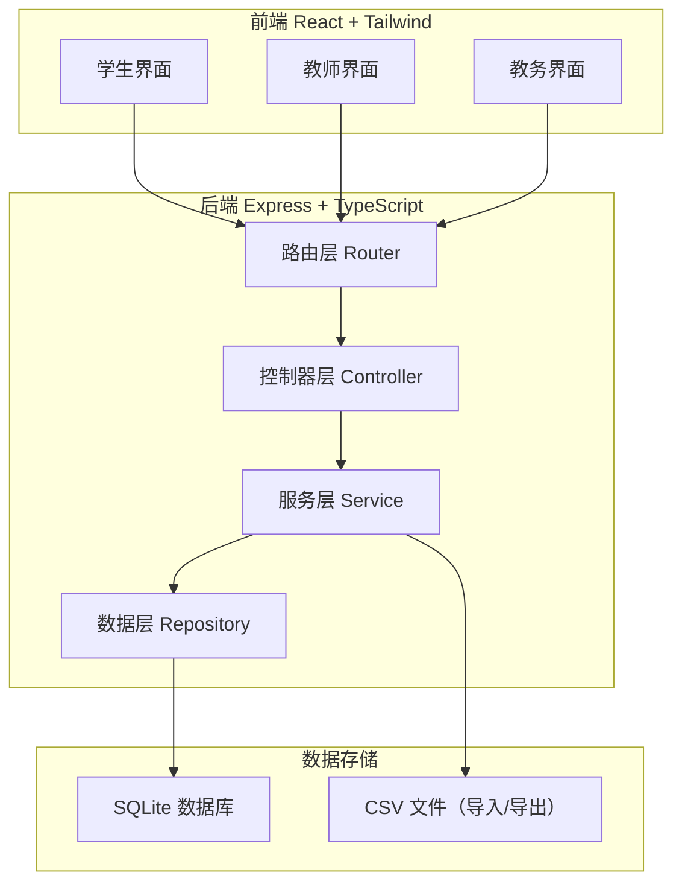
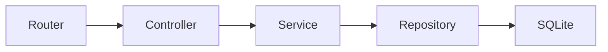
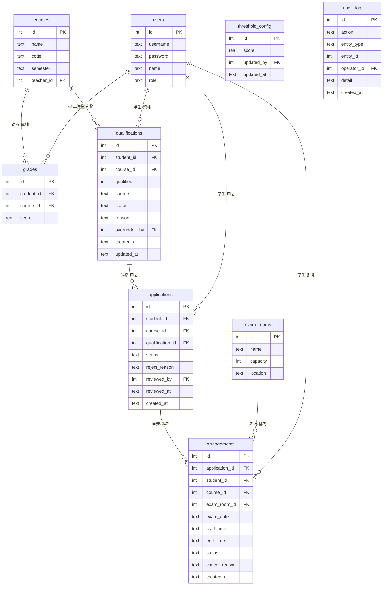

## 1. 架构设计



## 2. 技术说明

- 前端：React@18 + Tailwind CSS@3 + Vite
- 初始化工具：vite-init（react-express-ts 模板）
- 后端：Express@4 + TypeScript（ESM）
- 数据库：SQLite（better-sqlite3），数据文件存于项目根目录 `data/db.sqlite`
- 状态管理：Zustand
- 图标：lucide-react
- CSV 解析/生成：papaparse

## 3. 路由定义

| 路由 | 用途 |
|------|------|
| `/login` | 登录页 |
| `/student/dashboard` | 学生仪表盘 |
| `/student/qualifications` | 学生查看资格 |
| `/student/applications` | 学生申请管理 |
| `/student/schedule` | 学生排考查看 |
| `/teacher/dashboard` | 教师仪表盘 |
| `/teacher/courses` | 教师课程与资格 |
| `/teacher/schedule` | 教师排考查看 |
| `/admin/dashboard` | 教务仪表盘 |
| `/admin/grades` | 成绩管理（导入/查看） |
| `/admin/qualifications` | 资格管理（查看/覆盖/取消） |
| `/admin/applications` | 申请审核 |
| `/admin/exam-rooms` | 考场管理 |
| `/admin/arrangements` | 排考安排 |
| `/admin/export` | 导出页 |
| `/admin/threshold` | 阈值配置 |

## 4. API 定义

### 4.1 认证

```
POST /api/auth/login   { username, password, role } → { token, user }
```

### 4.2 成绩

```
POST   /api/grades/import       { csv content }     → { imported, errors }
GET    /api/grades              ?courseId=&studentId= → Grade[]
```

### 4.3 资格

```
GET    /api/qualifications      ?studentId=&courseId=&status= → Qualification[]
GET    /api/qualifications/:id                                   → QualificationDetail
POST   /api/qualifications/:id/override  { qualified, reason } → Qualification
POST   /api/qualifications/:id/cancel    { reason }             → Qualification
```

### 4.4 申请

```
POST   /api/applications                { courseId }                → Application
GET    /api/applications                ?studentId=&status=        → Application[]
POST   /api/applications/:id/approve    {}                         → Application
POST   /api/applications/:id/reject     { reason }                 → Application
DELETE /api/applications/:id            {}                         → Application（撤回）
```

### 4.5 考场

```
GET    /api/exam-rooms                  → ExamRoom[]
POST   /api/exam-rooms                  { name, capacity, location } → ExamRoom
PUT    /api/exam-rooms/:id              { name, capacity, location } → ExamRoom
DELETE /api/exam-rooms/:id              → void
```

### 4.6 排考

```
POST   /api/arrangements                { applicationIds, examRoomId, examDate, startTime, endTime } → Arrangement[]
GET    /api/arrangements                ?studentId=&courseId=&examRoomId= → Arrangement[]
DELETE /api/arrangements/:id            → Arrangement（取消，释放座位）
```

### 4.7 导出

```
GET    /api/export/notification-list    ?format=csv → CSV file
GET    /api/export/exam-schedule        ?format=csv → CSV file
```

### 4.8 阈值

```
GET    /api/threshold                   → ThresholdConfig
PUT    /api/threshold                   { score } → ThresholdConfig
GET    /api/threshold/history           → ThresholdHistory[]
```

### 4.9 类型定义

```typescript
interface User {
  id: number
  username: string
  name: string
  role: 'student' | 'teacher' | 'admin'
}

interface Grade {
  id: number
  studentId: number
  courseId: number
  courseName: string
  studentName: string
  score: number
  semester: string
}

interface Qualification {
  id: number
  studentId: number
  studentName: string
  courseId: number
  courseName: string
  qualified: boolean
  source: 'auto' | 'manual_override'
  status: 'active' | 'cancelled' | 'overridden'
  reason?: string
  overriddenBy?: number
  createdAt: string
  updatedAt: string
}

interface Application {
  id: number
  studentId: number
  studentName: string
  courseId: number
  courseName: string
  qualificationId: number
  status: 'pending' | 'approved' | 'rejected' | 'withdrawn'
  rejectReason?: string
  reviewedBy?: number
  reviewedAt?: string
  createdAt: string
}

interface ExamRoom {
  id: number
  name: string
  capacity: number
  location: string
  usedSeats: number
}

interface Arrangement {
  id: number
  applicationId: number
  studentId: number
  studentName: string
  courseId: number
  courseName: string
  examRoomId: number
  examRoomName: string
  examDate: string
  startTime: string
  endTime: string
  status: 'scheduled' | 'cancelled'
  cancelReason?: string
  createdAt: string
}

interface ThresholdConfig {
  id: number
  score: number
  updatedBy: number
  updatedAt: string
}
```

## 5. 服务端架构图



## 6. 数据模型

### 6.1 ER 图



### 6.2 DDL

```sql
CREATE TABLE IF NOT EXISTS users (
    id INTEGER PRIMARY KEY AUTOINCREMENT,
    username TEXT NOT NULL UNIQUE,
    password TEXT NOT NULL,
    name TEXT NOT NULL,
    role TEXT NOT NULL CHECK(role IN ('student','teacher','admin'))
);

CREATE TABLE IF NOT EXISTS courses (
    id INTEGER PRIMARY KEY AUTOINCREMENT,
    name TEXT NOT NULL,
    code TEXT NOT NULL,
    semester TEXT NOT NULL,
    teacher_id INTEGER NOT NULL REFERENCES users(id)
);

CREATE TABLE IF NOT EXISTS grades (
    id INTEGER PRIMARY KEY AUTOINCREMENT,
    student_id INTEGER NOT NULL REFERENCES users(id),
    course_id INTEGER NOT NULL REFERENCES courses(id),
    score REAL NOT NULL,
    UNIQUE(student_id, course_id)
);

CREATE TABLE IF NOT EXISTS qualifications (
    id INTEGER PRIMARY KEY AUTOINCREMENT,
    student_id INTEGER NOT NULL REFERENCES users(id),
    course_id INTEGER NOT NULL REFERENCES courses(id),
    qualified INTEGER NOT NULL DEFAULT 0,
    source TEXT NOT NULL DEFAULT 'auto',
    status TEXT NOT NULL DEFAULT 'active' CHECK(status IN ('active','cancelled','overridden')),
    reason TEXT,
    overridden_by INTEGER REFERENCES users(id),
    created_at TEXT NOT NULL DEFAULT (datetime('now')),
    updated_at TEXT NOT NULL DEFAULT (datetime('now'))
);

CREATE TABLE IF NOT EXISTS applications (
    id INTEGER PRIMARY KEY AUTOINCREMENT,
    student_id INTEGER NOT NULL REFERENCES users(id),
    course_id INTEGER NOT NULL REFERENCES courses(id),
    qualification_id INTEGER NOT NULL REFERENCES qualifications(id),
    status TEXT NOT NULL DEFAULT 'pending' CHECK(status IN ('pending','approved','rejected','withdrawn')),
    reject_reason TEXT,
    reviewed_by INTEGER REFERENCES users(id),
    reviewed_at TEXT,
    created_at TEXT NOT NULL DEFAULT (datetime('now'))
);

CREATE TABLE IF NOT EXISTS exam_rooms (
    id INTEGER PRIMARY KEY AUTOINCREMENT,
    name TEXT NOT NULL,
    capacity INTEGER NOT NULL,
    location TEXT NOT NULL
);

CREATE TABLE IF NOT EXISTS arrangements (
    id INTEGER PRIMARY KEY AUTOINCREMENT,
    application_id INTEGER NOT NULL REFERENCES applications(id),
    student_id INTEGER NOT NULL REFERENCES users(id),
    course_id INTEGER NOT NULL REFERENCES courses(id),
    exam_room_id INTEGER NOT NULL REFERENCES exam_rooms(id),
    exam_date TEXT NOT NULL,
    start_time TEXT NOT NULL,
    end_time TEXT NOT NULL,
    status TEXT NOT NULL DEFAULT 'scheduled' CHECK(status IN ('scheduled','cancelled')),
    cancel_reason TEXT,
    created_at TEXT NOT NULL DEFAULT (datetime('now'))
);

CREATE TABLE IF NOT EXISTS threshold_config (
    id INTEGER PRIMARY KEY AUTOINCREMENT,
    score REAL NOT NULL,
    updated_by INTEGER NOT NULL REFERENCES users(id),
    updated_at TEXT NOT NULL DEFAULT (datetime('now'))
);

CREATE TABLE IF NOT EXISTS audit_log (
    id INTEGER PRIMARY KEY AUTOINCREMENT,
    action TEXT NOT NULL,
    entity_type TEXT NOT NULL,
    entity_id INTEGER NOT NULL,
    operator_id INTEGER NOT NULL REFERENCES users(id),
    detail TEXT,
    created_at TEXT NOT NULL DEFAULT (datetime('now'))
);

-- 初始数据
INSERT INTO users (username, password, name, role) VALUES
    ('admin', 'admin123', '教务管理员', 'admin'),
    ('teacher1', 'teacher123', '张老师', 'teacher'),
    ('student1', 'student123', '李同学', 'student'),
    ('student2', 'student123', '王同学', 'student'),
    ('student3', 'student123', '赵同学', 'student');

INSERT INTO threshold_config (score, updated_by) VALUES (60, 1);
```
